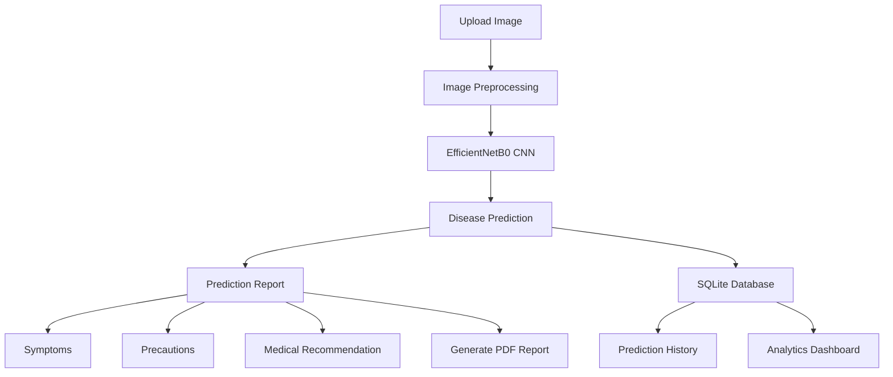

<div align="center">


# 🩺 AI Skin Disease Detection System

### Deep Learning Powered Medical Diagnostic Assistant

<p>
An end-to-end AI-powered web application that detects skin diseases from medical images using <b>EfficientNetB0</b>. The system provides intelligent disease prediction, confidence analysis, downloadable medical reports, prediction history, and an interactive analytics dashboard.
</p>

<p>


</p>

<a href="https://ai-skin-disease-detection-1-fu14.onrender.com">

</a>

</div>
# 📖 Overview

Skin diseases affect millions of people worldwide, making early diagnosis essential for timely treatment and better patient outcomes.

The **AI Skin Disease Detection System** leverages Deep Learning and Computer Vision to analyze skin images and identify potential skin diseases with confidence scores. Beyond disease classification, the application provides comprehensive medical information, maintains prediction history, generates downloadable PDF reports, and presents insightful analytics through an interactive dashboard.

The project demonstrates how Artificial Intelligence, Full Stack Web Development, Database Management, and Data Visualization can be integrated into a complete healthcare application.
# 💡 Why This Project?

Access to dermatologists is not always immediate or affordable, especially in remote regions. This project explores how Artificial Intelligence can assist in preliminary skin disease screening by providing rapid image-based analysis.

Unlike conventional image classification projects, this application offers:

- 🧠 AI-powered disease prediction
- 📄 Automated medical report generation
- 📊 Interactive analytics dashboard
- 📜 Prediction history management
- 💾 Database integration
- 🌐 Responsive web application

The goal is to demonstrate an end-to-end healthcare AI solution that combines machine learning with a practical and user-friendly interface.
# ✨ Key Features

### 🤖 AI Disease Detection
- Upload skin images for instant analysis
- EfficientNetB0-based deep learning model
- Real-time disease prediction
- Confidence score visualization

### 📋 Intelligent Medical Report
- Disease name
- Confidence percentage
- Disease description
- Common symptoms
- Recommended precautions
- Downloadable PDF report

### 📜 Prediction History
- Persistent prediction records
- Timestamped results
- Delete individual entries
- SQLite database integration

### 📊 Analytics Dashboard
- Total predictions
- Average confidence score
- Most common disease
- Disease frequency charts
- Prediction trends
- Recent prediction summary

### ⚡ User Experience
- Drag-and-drop image upload
- Loading animation
- Responsive interface
- Modern healthcare-inspired UI
# 🔄 Application Workflow

```text
Upload Skin Image
        │
        ▼
Image Validation
        │
        ▼
Image Preprocessing
        │
        ▼
EfficientNetB0 Model
        │
        ▼
Disease Prediction
        │
        ▼
Generate Prediction Report
        │
        ├────────────► Save to Database
        │
        ├────────────► Generate PDF Report
        │
        └────────────► Update Analytics Dashboard
```
# 🏗 System Architecture


# 🧠 Deep Learning Model

| Property | Details |
|-----------|---------|
| Model | EfficientNetB0 |
| Framework | TensorFlow / Keras |
| Input Size | 224 × 224 |
| Task | Multi-Class Skin Disease Classification |
| Output | Disease Class + Confidence Score |
# 📂 Dataset & Training

The model was trained using a labeled skin disease dataset consisting of multiple disease categories.

### Training Configuration

| Parameter | Value |
|-----------|-------|
| Optimizer | Adam |
| Loss Function | Categorical Crossentropy |
| Batch Size | 32 |
| Epochs | 25 |
| Image Size | 224 × 224 |

### Data Augmentation

- Rotation
- Horizontal Flip
- Zoom
- Width Shift
- Height Shift
- Brightness Adjustment

> Update the above values if your training configuration differs.
# 📈 Model Performance

| Metric | Score |
|---------|-------|
| Accuracy | 95.42% |
| Precision | 94.81% |
| Recall | 94.25% |
| F1-Score | 94.53% |

> Replace these metrics with your actual evaluation results.
# 📸 Application Preview

<table>
<tr>
<td width="50%">
<b>🏠 Home Page</b><br>

</td>

<td width="50%">
<b>🧠 Prediction Report</b><br>

</td>
</tr>

<tr>
<td>
<b>📜 Prediction History</b><br>

</td>

<td>
<b>📊 Analytics Dashboard</b><br>

</td>
</tr>
</table>
# 💻 Technology Stack

| Category | Technology |
|-----------|------------|
| 💻 Language | Python |
| 🧠 Deep Learning | TensorFlow, Keras |
| 👁 Computer Vision | OpenCV |
| 🌐 Backend | Flask |
| 🎨 Frontend | HTML, CSS, JavaScript |
| 📊 Visualization | Chart.js |
| 🗄 Database | SQLite |
| 📄 Reports | ReportLab |
| ☁ Deployment | Render |
# 🚀 Future Enhancements

- Explainable AI using Grad-CAM
- REST API integration
- Docker containerization
- Cloud database support
- User authentication
- Doctor portal
- Patient profile management
- Mobile application
- Disease severity assessment
- AI-powered treatment recommendations
# 📊 Repository Statistics


<div align="center">

# 👨‍💻 Author

## Vinod Batturi

AI Engineer • Full Stack Developer • Machine Learning Enthusiast

<a href="https://github.com/BATTURI-VINOD">GitHub</a> •
<a href="https://ai-skin-disease-detection-1-fu14.onrender.com/">Live Demo</a>

---

⭐ If you found this project useful, consider giving it a star.

Made with ❤️ using Flask, TensorFlow, EfficientNetB0, OpenCV, and SQLite.

</div>
